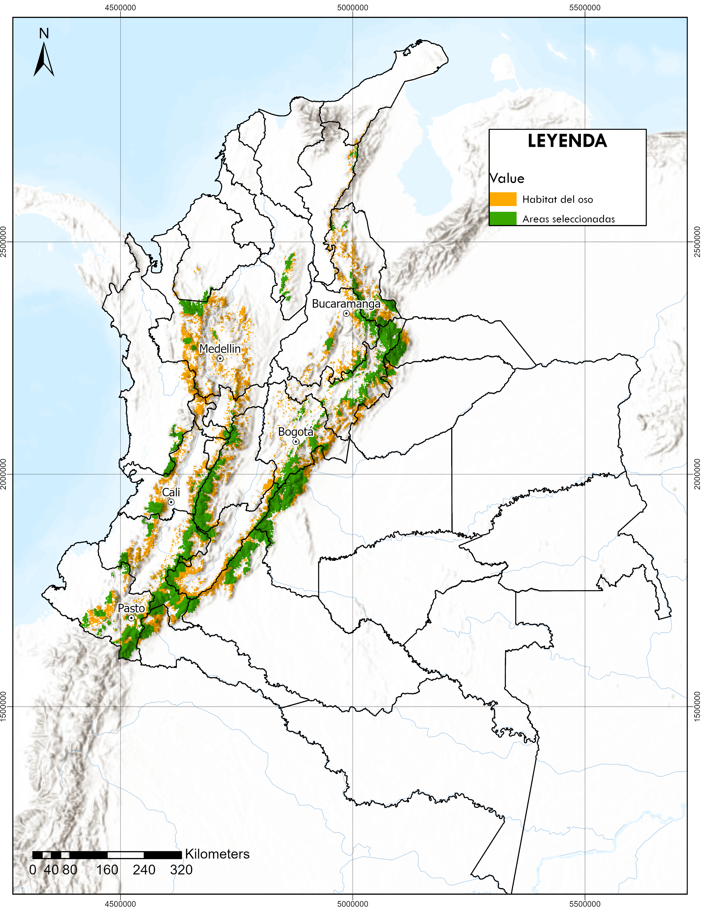

# Identificación de Áreas Prioritarias para la Conservación del Oso Andino (*Tremarctos ornatus*) en Colombia

**Autora:** Diana Millan
**Fecha:** Marzo 2026

---



---

## Descripción

Este repositorio contiene el análisis de priorización espacial para la conservación del **Oso Andino (*Tremarctos ornatus*)** en Colombia. Se utiliza el paquete [`prioritizr`](https://prioritizr.net/) en R para resolver un problema de optimización tipo **Minimum Set Problem**: seleccionar las celdas de menor costo de oportunidad que cumplan metas de representación basadas en la **Población Mínima Viable (PMV = 2,500 individuos)**.

---

## Archivos del repositorio

| Archivo | Tipo | Descripción |
|---|---|---|
| `areas_prioritarias_oso_andino.R` | Script R | Código principal del análisis. Carga insumos, define el problema de conservación, resuelve la optimización y genera todos los resultados y figuras. |
| `solucion_areas_prioritarias.tif` | Raster GeoTIFF | Resultado espacial de la priorización. Celdas seleccionadas (valor = 1) como áreas prioritarias para conservación del oso andino. |
| `evaluacion_features.csv` | Tabla CSV | Evaluación del cumplimiento de metas por feature: hábitat del oso, páramos y calidad de hábitat. Incluye área total, área seleccionada y % de representación. |
| `sensibilidad_blm.csv` | Tabla CSV | Análisis de sensibilidad al parámetro BLM (*Boundary Length Modifier*). Muestra cómo varía el costo, la compacidad y la representación según distintos valores de BLM. |
| `mapa_areas_prioritarias.png` | Imagen PNG | Mapa final de las áreas prioritarias seleccionadas sobre el territorio colombiano. |
| `tradeoff_blm.png` | Imagen PNG | Gráfico de trade-off entre costo de la solución y compacidad espacial (BLM), usado para seleccionar el valor óptimo de BLM. |
| `diagrama_flujo.pdf` | PDF | Diagrama del flujo metodológico del análisis, desde los insumos hasta los resultados. |
| `Documentacion_prueba.pdf` | PDF | Documentación complementaria del ejercicio de priorización. |

---

## Metodología resumida

```
Insumos raster                     Problema de optimización
─────────────────                  ───────────────────────────────
Distribución oso andino  ──┐
Costo de oportunidad     ──┼──►  Minimum Set Problem  ──►  Solución espacial (.tif)
Huella humana            ──┤       (prioritizr / CBC)
Páramos (shapefile)      ──┘
```

1. **Preparación de insumos:** reproyección y remuestreo de capas al mismo sistema de referencia y resolución.
2. **Definición del problema:** metas de representación por feature basadas en la PMV.
3. **Optimización:** resolución con el solver CBC mediante el paquete `prioritizr`.
4. **Análisis de sensibilidad:** evaluación de múltiples valores de BLM para encontrar el balance entre costo y compacidad.
5. **Exportación de resultados:** mapa raster, tablas de evaluación y figuras.

---

## Requisitos para ejecutar el script

```r
install.packages(c("prioritizr", "terra", "sf", "ggplot2", "dplyr", "patchwork"))
```

> El solver **CBC** debe estar instalado. Se puede instalar con el paquete `rcbc` o descargarlo desde [COIN-OR](https://github.com/coin-or/Cbc).

---

## Resultados principales

- Se seleccionaron **~50,000 km²** como áreas prioritarias.
- Representación del hábitat del oso: **≥ 52%**
- Representación de páramos: **100%**
- BLM óptimo seleccionado según análisis de trade-off.
